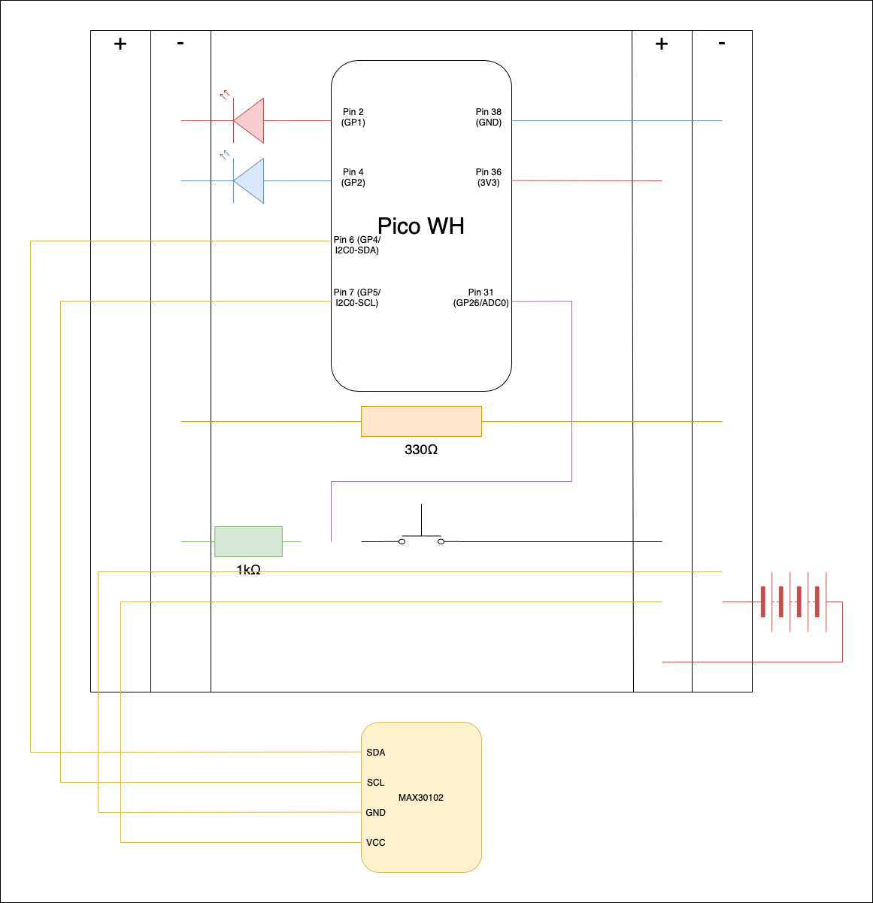
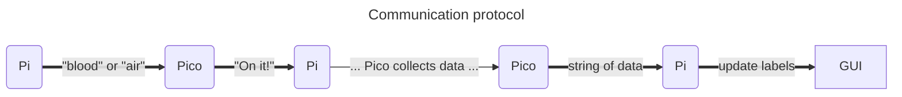
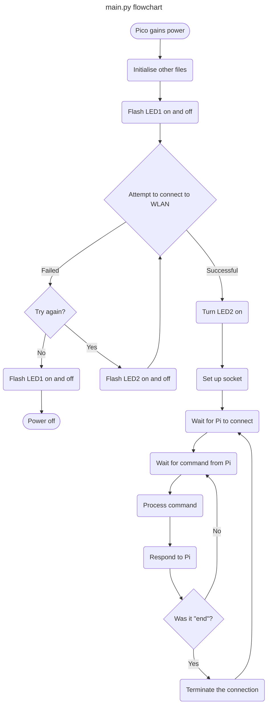

# Raspberry Pi Competition - PA Consulting
## Introduction
This app was developed by the team at Callywith College for the PA Raspberry Pi Competition 2024, where the objective was to create software (predominantly using a Raspberry Pi) that can help someone's health. It is designed to analyse the health of the user using a series of questions, sensors and calculations. The target audience is gamer's as they are a notoriously unhealthy subpopulation. The main software and display is on the Raspberry Pi; a Pico W is used to collect certain data before sending the results to the Pi via a WiFi connection.

## Parts/devices
+ Raspberry Pi with connection to any WLAN (I'm using the Raspberry Pi 3b)
+ Raspberry Pi Pico W(H)
+ Breadboard (or you can solder the parts together)
+ 1 MAX30102 sensor (it must use a V8520 MCU - for example [this one](https://www.dfrobot.com/product-2529.html))
+ 8 Male-to-male wires
+ 2 LEDs (ideally different colours)
+ 1 5V DC power supply (ideally batteries for portability)
+ 1 Momentary push button
+ 1 330&Omega; resistor
+ 1 1k&Omega; resistor
+ 1 USB to microUSB cable

|Recommended products|Cost|
|-------------------|----|
|[Pico WH](https://thepihut.com/products/raspberry-pi-pico-w?variant=41952994787523)|£7.20|
|[Electronics Starter Kit](https://www.amazon.co.uk/BOJACK-Electronics-Potentiometer-tie-Points-Breadboard/dp/B09DCB5D9N)|£15.99|
|[MAX30102 Sensor](https://thepihut.com/products/gravity-max30102-heart-rate-and-oximeter-sensor)|£21.30|
|Total|£44.49|

## Packages
On the Raspberry Pi, most modules should be pre-installed with python3:
+ socket
+ tkinter
+ time

You may need to run `[sudo] pip install func_timeout` to install *func_timeout*. For reference, I'm using version 4.3.5

You should also use `[sudo] pip install chatterbot` in the terminal to install *chatterbot* and *chatterbot-corpus*. I'm using chatterbot v1.0.4 and chatterbot-corpus v1.2.0. Once these are installed, find where their source code is, for example */home/pi/.local/lib/python3.9/site-packages*. Then go to *chatter_corpus/data/custom*. You should see one file titled *myown.yml*. Replace that file with the [*myown.yml* file in this repository](/Raspberry_Pi_Code/myown.yml)

In addition, you should [install Thonny](https://thonny.org) on the Pi

On the Raspberry Pi Pico W, if not already using MicroPython, you must flash the device with the MicroPython uf2 (go to [MicroPython's website](https://micropython.org/download/RPI_PICO_W/) for more information on how to do this). All necessary modules (*machine*, *time*, *socket* and *network*) should already be installed with MicroPython. I'm using MicroPython v1.22.2

## Setup
1. Turn on the Raspberry Pi and connect to the Internet
2. Download and unzip this repository
3. Make sure all the necessary packages are installed on the Raspberry Pi. Modify *chatterbot_corpus/data/custom/myown.yml* as described above
4. Set up the parts as shown below:

 

> [!WARNING]
> Remove the DC power supply at this point because having this connected while the Pico is connected to the computer could damage the electronics

5. If the Pico is already using MicroPython, use the USB-to-microUSB cable to connect the Pico to the Raspberry Pi. Otherwise, [install MicroPython](https://micropython.org/download/RPI_PICO_W/) first
6. Open Thonny and select the Pico (RP2040) as the interpreter
7. Transfer the Pico's code (from this repository) to the Pico
8. Modify lines 14 and 15 in *Pico_W_Code/main.py* so it can connect to your network (this must be the same LAN that the Raspberry Pi is connected to)
9. Run main.py on the Pico. Make a note of the first IP address (of the array of addresses) printed in the Shell
10. Set line 9 in *Raspberry_Pi_Code/socket_client.py* to `pico = socket.getaddrinfo(addr,80)` where *addr* is the string of the Pico's IP address
11. Remove the USB cable and reattach the DC power supply - it is all set up and ready for use now!

## Instruction
1. Connect the DC power supply to the breadboard. After a second or two, you should see the LED at Pin 2 (GP1) light up for two seconds before turning off - this means the *main.py* script is running properly
2. Over the next minute or so, the LED at Pin 4 (GP2) will flash on for one second then turn off again for a few seconds repeatedly until it connects to the WLAN. You will know that it has connected properly because that LED will turn on and stay on until the device loses power or encounters an error
3. Run *Raspberry_Pi_Code/main.py* on the Raspberry Pi. This will open the GUI and attempt to connect to the Pico. As long as the Pico has connected to the same WLAN as the Pi is on, and the Pi is setup to connect to the correct IP address, they will connect and exchange confirmation message to each other
4. Go through the GUI and complete all the sections as accurately as possible (you may need additional measuring devices for some parts)
5. For the **Blood/Temperature** and **Breathing** sections, press the **Get Readings** button. Read the instructions in the pop-up box then close it (by pressing **OK**). This will then alert the Pico that you want to get the corresponding data. Here is a more detailed descriptions of the details:
   - For the **Blood/Temperature** readings, hold one finger down on the sensor on the MAX30102. There should be a red light under your finger while you do this. Hold it there until either/both the red light turns off or the GUI displays new readings underneath the clicked button; this should take about 10 seconds
   - For the **Breathing** readings, breathe normally but everytime you get to the same point in a breath (eg at the top), press the push button on the breadboard. Do this about 7 times and it will calculate your average breathing rate. You will know that it has finished because the readings in the GUI will update
  
> [!TIP]
> If any of these readings seem drastically wrong, you can redo them as many times as you want!

6. Once all the sections are completed fully, press **Submit**. The computer will process all your data and give you a full analysis of your health including a personalised list of improvements to make
7. Next, you can either press **Quit** and it will terminate the connection to the Pico then close the GUI, or press **Ask Harry...** if you have any outstanding questions related to your results or health and wellbeing in general
8. If you choose the latter option, you can type in any questions for our ChatBot Harry to answer, then press **Get answer** to get its result. You can do this any many times as you want or you can just press **Quit** to end the program
9. If you want to do it again, reopen *Raspberry_Pi_Code/main.py* and it should reconnect to the Pico
10. To turn off or restart the Pico, simply remove the power source (and reattach it to reset it)

## Explanation
#### Raspberry_Pi_Code
+ gui.py
   + MyEntry (class) - This is a simple derived class (inheriting methods and properties from the **tkinter.Entry** class) with a few extra methods: for each mode (string, integer only, decimal or integer only) there is one method (eg `makeInt(key)`) to set the instance as one of these modes and define which key in `all_data` it should use, and another method (eg `validateInt()`) that validates the input every time the value of the object changes   
   + GUI (class) - This is the main GUI on the Raspberry Pi
      + The `__init__()` method initialises the tkinter window and creates all the sections that go in it. It uses a number of additional functions (for example `basicfr(fr)`) to do this
      + The `start()` method is called by a secondary thread in *main.py* because `self.root.mainloop()` runs until the tkinter window is closed
      + The static method `all_children(wid)` returns a list of all the children (and children of those children ... and so on) of a widget. This is a very helpful function so I find myself using it in all my tkinter projects
      + The `gotonextentry()` method is a simple sub-routine that is only used to improve the UX. It allows the user to press Enter to move between buttons and textboxes
      + The `changestateto(state)` method is a quick way of disabling or enabling the window. It's used to prevent the user from interacting with the window while they are supposed to be using the Pico's sensors
      + Both the `getblood()` and `getair()` methods work by first using a 'messagebox' to inform the user of what to do, then disabling the window. Next it gets the data (via the Connection class) and finally it enables the window again
      + The `submit()` method first checks that all the data is present (presence check), then it terminates the socket connection to the Pico and prepares the GUI for the 'results' screen. Next, it performs all the necessary calculations on the data and finally it outputs the results and suggestions to the window
      + The `loadharryfr()` method is called by pressing the **Ask Harry...** button. It clears the tkinter window and creates the appropriate widgets so the user can interact with the ChatBot
      + `getanswer()` is a simple method that is called by pressing the **Get answer** button. First, it disables the window. Then, it checks that the ChatBot has loaded and that the entry isn't empty (presence check). Next, if everything is OK, it gets an answer from the ChatBot using the text in the entry box. After which it updates the label appropriately, and finally, the window is enabled again
+ harry.py
   + Harry (class) - This is the ChatBot
      + The `__init__()` method creates and trains the bot
      + The `getanswer(question)` function gets the response from the bot and returns it
+ main.py - This handles the co-ordination between the GUI, the Harry and the Connection classes through the use of threading: a thread is created to run the GUI, then once that has loaded fully, another thread is made to load/train the ChatBot (Harry), meanwhile the main thread starts attempting to connect to the Pico and uses recursion to ensure that it continues to make attempts until it successfully connects
+ socket_client.py
   + Connection (class) - This class handles all communication with the Pico
      + The `__init__()` method attempts to connect to the Pico (at port 80 on whatever IP address you've specified in line 9) through the **socket** module
      + The `send(msg)` method packages and sends the string `msg` to the Pico via the socket
      + The `receive()` function waits for a response from the Pico, unpacks it and returns it (unless it is the keyphrase "end" which will terminate the connection)
      + Both the `getblooddata()` and `getairdata()` methods follow a similar protocol, using timeouts to prevent the program from running indefinitely. The protocol works as shown below:

#### Pico_W_Code
+ bloodreader.py - This handles all the commands for and data from the MAX30102, as well as the processing of the data. When run, it initialises the I2C network and creates a MyMAX30102 class instance
   + The `getReadings()` function is called by *main.py* when it receives the "blood" command from the Pi. It follows the steps:
      1. Turn on the sensor by writing 0x01 to register 0x21
      2. Get the inital temperature by reading registers 0x14 and 0x15 - this should be the temperature of the room
      3. Continuously get heartrate readings by reading 8 bytes from register 0x0C every 100ms, for 10s
      4. Average the heartrate readings (ignoring any 0 bpm reeadings)
      5. Get the final temperature by reading registers 0x14 and 0x15 again - this should be the temperature of the finger/body
      6. Turn off the sensor by writing 0x02 to register 0x21
      7. Return a string containing the data in the format: "[roomTemp],[bodyTemp],[heartrate]"
+ breathcounter.py - This calculates the breathing rate of the user. It uses a Analog to Digital Converter pin to work out whether the button on the breadboard has been clicked. The user should click the button to start the timer, then they must click it 6 more times (once for each breath). After the last button press, the timer will stop and the average breathing rate will be calculated and returned
+ main.py - This is what executes when the Pico gains power. It handles all communication with the Pi, and controls the *bloodreader.py* and *breathcounter.py* programs
   + Client (class) - This class is simply used to abstract the complicated communication code from the main program, which makes everything more readable and maintainable
      + The `__init__()` method contains the 'waiting for a client to connect' code, then collect data from the client
      + The `getmsg()` function waits for the next command from the Pi, then unpacks and returns it
      + The `close()` method terminates the connection to that particular client
      + The `respondTo(request)` function handles the processing of the requests through a series of selection statement. It then sends the response. It will return true unless the request was the keyphrase "end", or sending the response failed. The return value determines whether or not the connection will remain open (for example, if request == "end", it will return False, which will close the connection and wait for another client to connect)
      + The `getblood()` and `getair()` functions are called when the request is their corresponding keyphrase. They first respond by sending the keyphrase "On it!" back to the Pi to show that they successfully received  and processed the command. They then procure the necessary data using the other files, and return this data to the `respondTo(request)` function
   
   When the main program gains power/executes, it:
   1. Initialises the *bloodreader.py* and *breathcounter.py* files
   2. Flashes the LED at Pin 1 (GP2) on for two seconds to prove that it has power and the file is running properly
   3. After which, it attempts to connect to the WLAN described in lines 14 and 15, using the **network** module. If this is successful, the program continues on. Otherwise, the LED at Pin 2 (GP4) will flash on for half a second to signal a failed attempt, and it will try again. It attempts to connect to the WLAN up to 11 times. If it still fails after that, the LED at Pin 1 (GP2) will flash on again for two seconds to signal that the device is powering off. If it does this, you should either remove and replace the power source to restart it, or connect it to the Raspberry Pi via USB to debug it in Thonny
   > Note: You will know that it has connected to the WLAN because the LED at Pin 2 (GP4) will stay on indefinitely!
   4. It will then (using the **socket** module) create a socket at port 80 on its IP address
   5. Once the socket is set up, the Pico will wait until the Pi connects to it
   6. Once connected, the Pico will continually wait for the Pi to send commands, then it will process and respond to the commands appropriately. If the command was the keyphrase "end", the socket will be closed and the Pico will resume waiting for the Pi to connect again

+ mymax.py
   + MyMax30102 (class) - This handles all the direct communication to the MAX30102 sensor through the I2C network. It has two methods: `write(reg, val)` writes the integer, `val`, to the register, `reg`; `read(reg, n_bytes=1)` reads a number of bytes, `n_bytes` (by default `n_bytes = 1`), from the register, `reg`, and returns it

## Evaluation
Overall, we would say that the project went well - we created a functional, reliable piece of software that could greatly improve the health of its users. With that being said, we did not manage to create every aspect of the originally proposed solution: we had hoped to add a Neural Network to more accurately calculate how healthy the user is. The reason we could achieve these higher goals is that the other aspects (predominantly the use of the MAX30102 sensor) took significantly longer than predicted to create.

Problems we encountered includes:
+ The barometer that we were going to use for more accurate temperature measurements failed to connect to the I2C network and despite a hours of research, testing and debugging, we had to concede
+ The MAX30102 sensor was extremely inconsistent with all the documentation for it - at first we thought the code was the problem or that our understanding of I2C was incorrect. Eventually we had to email the manufacturors to ask if they knew what the problem was; they said that the data sheet we were using was not the correct one as the particular product that we purchased had an additional interface between the Pico and the sensor. With the correct data sheet, understanding the readings was much easier and we could finally get reliable, accurate data from the device
+ The push button on the breadboard seemed to let some current through even when not pressed - the solution to this was to use an ADC pin on the Pico, rather than an GP pin so that readings can be any value from 0 - 65,532 (rather than just 0 or 1). We also had to include an additional wire from the button to Ground. Then by using a threshold of 60,000, the button would only appear pressed when it actually is pressed
+ There was no easy way to restrict the characters that can be entered in the **tkinter.Entry**s. The best solution we found was to create a derived class that has certain overrides to prevent the text from changing if it breaches certain criteria
+ We were unsure how to go about connecting the Pico and the Pi. We tried setting up an Wireless Access Point on the Pi, then we tried setting up a WAP on the Pico. We settled on using a WLAN such as that on a WiFi router, which both the Pico and Pi can connect to and send messages through

Although these issues prevented us from being able to achieve everything that we set out to do, they allowed us to learn more about both the hardware and software used. Most importantly though, we improved our teamwork, problem solving, and pattern recognition skills!
